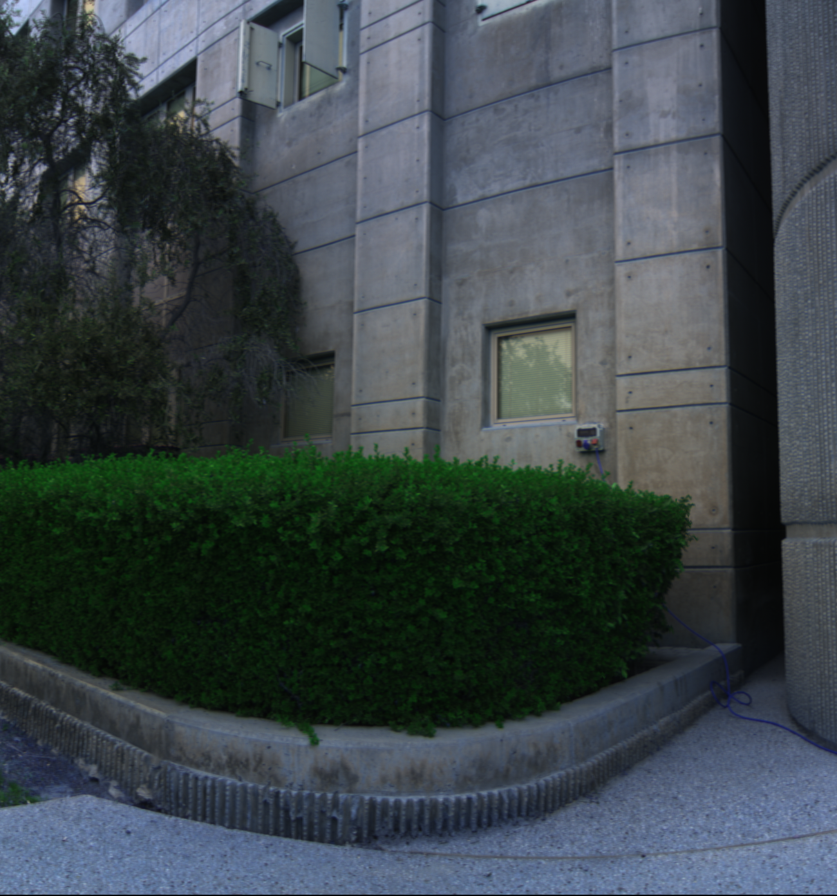

# Hyperspectral Image Restoration: Investigating the Impact of Noise and Occlusion

This repository includes code implementation for our project in the Computational Imaging course at IMT Atlantique, spring 2024.

This project is inspired by the paper of [Théo Bodrito et al](https://proceedings.neurips.cc/paper/2021/file/2b515e2bdd63b7f034269ad747c93a42-Paper.pdf). Their original implementation can be found [here](https://github.com/inria-thoth/T3SC).

Members:
- DUONG Hoang
- LUC Tan Tho
- Nguyen Le-Kim

Parts of this repository are forked directly from the original one. The brief description of our work is described in the table below:

<table>
<tr><td>

| File name | Description |
|-----------|-------------|
|run_compi.ipynb||
|COMPI_final.pdf|presentation slides of the topic|

</td></tr> </table>

## 1. Introduction
Trainable Spectral-Spatial Sparse Coding Model (T3SC Model) is a robust method using a hybrid approach (i.e. Deep Learning and Sparse Coding) to address the denoising problem of hyperspectral images. With a 2-layer sparse coding architecture, it offers high flexibility in terms of different bands of sensor and impressive capability in image restoration. Moreover, a 3-layer CNN function as a noise estimator provides excellent adaptivity to various types of noise.

In the scope of this project, we are interested in studying the robustness in case of complex noise. Furthermore, we also test the capability of restoration when some information is completely missing (occlusion).


## 2. Investigation on the impact of noise and occlusion
### 2.1. Noise
We implement some colors of noise to evaluate the model in dealing with complex noise. Some bands are affected by these noises (0.33 as default) and the rest have Gaussian white noise. 

There are 3 types supported currently: Pink, Brownian, and Blue. Noises and their impacts on Lena's image are shown below.


### 2.2. Occlusion
An area in the 2D image is zeroed. Similar to the previous part, we choose some bands to mask and add Gaussian white noise to every band of the image.


## 3. Experiments and Results
### 3.1. Experiments
Firstly, we run several tests for three new noises and occlusion using the pretrained models provided by authors. Then, we train our own models and run inference once again to evaluate the improvement.

**For noise**:
- The three noises with pretrained models.
- Pink noise with its own trained model (same configured parameters).
- Pink noise with its own trained models (different configured parameters).
- Other noise with trained model for pink noise (same configured parameters).

**NOTE:** Pink, Brownian and blue noise are characterized by variance $\sigma$, number of affected bands and noise scale.

**NOTE 2:** Currently, we only show the result for pink noise.

**For occlusion**:
- Tests with pretrained models.
- Test with its own trained model (same configured parameters).
- Test with its own trained model (different configured parameters).

**NOTE:** Occlusion is characterized by number of affected bands and size of masked area.

### 3.2. Results
**Noise**  
Firstly, we test the pink-noisy image (as described previously) at different noise power scale with Gaussian pretrained model. Later, we train a model of noisy pink with noise level = 2.5 then evaluate the performance at other values. In all tests, we use $\sigma = 25$ and 33% of bands are affected as default.

*Noise level = 1.5*
Original |Noisy|Gaussian pretrained | Our weights
:---:|:---:|:---:|:---:
||| 

*Noise level = 2.5*
Original |Noisy|Gaussian pretrained | Our weights
:---:|:---:|:---:|:---:
||| 

*Noise level = 5*
Original |Noisy|Gaussian pretrained | Our weights
:---:|:---:|:---:|:---:
||| 

The performance metrics are as follows:
Noise level| Weights | MPSNR in | MPSNR out | MSSIM in | MSSIM out 
:---:|:---:|:---:|:---:|:---:|:---:
1.5 |Gaussian pretrained|21.698|38.199|0.313|0.934
1.5 |Ours|21.698|38.252|0.313|0.954
2.5 |Gaussian pretrained|17.662|28.037|0.218|0.499
2.5 |Ours|17.662|36.717|0.218|0.942
5 |Gaussian pretrained|12.805|18.952|0.106|0.131
5 |Ours|12.805|30.824|0.106|0.794

**Occlusion**  
We train 2 models with around 33% and 50% number of bands being affected, respectively. Then, we perform tests with some pretraied models and our weights on the ICVL dataset. Since each image contains 31 bands, we set the number of occluded bands to 10 and 5 corresponding to 33% and 16.5% respectively.

*Results of 10 bands*

Original |Gaussian pretrained $\sigma=25$ | Stripes pretrained
:---:|:---:|:---:
||

Input |Our weights 0.33 | Our weights 0.5
:---:|:---:|:---:
||

*Results of 5 bands*

Original |Gaussian pretrained $\sigma=25$ | Stripes pretrained
:---:|:---:|:---:
||

Input |Our weights 0.33 | Our weights 0.5
:---:|:---:|:---:
||

The performance metrics of 10 affected bands:  
**MPSNR in** = 20.818, **MSSIM in** = 0.159

Test | MPSNR out | MSSIM out 
:---:|:---:|:---:
Gaussian pretrained|39.234|0.971
Stripes pretrained|29.219|0.693
Our weights 0.33 (10 bands)|40.970|0.970
Our weights 0.5 (10 bands)|40.982|0.968

The performance metrics of 5 affected bands:  
**MPSNR in** = 20.863, **MSSIM in** = 0.159

Test | MPSNR out | MSSIM out 
:---:|:---:|:---:
Gaussian pretrained|41.098|0.972
Stripes pretrained|29.639|0.693
Our weights 0.33 (10 bands)|41.887|0.970
Our weights 0.5 (10 bands)|40.712|0.968

### 3.3. Conclusion
- The model proves the robustness not only for Gaussian noise but also its variants for certain percentages of affected bands.
- In case occlusion, the model not only maintain good capability of noise denoising but also well reconstruct the missing area using information from unaffected bands. The performance can be slightly improved if we use a model trained with higher occluded band ratio to recover an image with lower ratio.

## 4. How to run
### 4.1. Requirements
The model is developed with Python 3.8.8. You can run the command below, or follow the instruction in **run_compi** notebook.
```
pip install -r requirements.txt
```

### 4.2. Training and Testing
Please visit the original repository for more details. Currently, there are three available colors of noise: Pink, Brownian and Blue.

### Some examples
**Train**

ICVL dataset with pink noise
```
$ python main.py data=icvl noise=pink
```

Washington DC Mall dataset with occlusion
```
$ python main.py data=dcmall noise=occlusion
```

**Test**

```
$ python main.py mode=test data=icvl noise=pink noise params.sigma=25 model.ckpt=path/to/icvl_pink_25.ckpt
```

Some pretrained models can be found here. Feel free to modify the noise parameters to see the differences. You can access this folder for more information.
