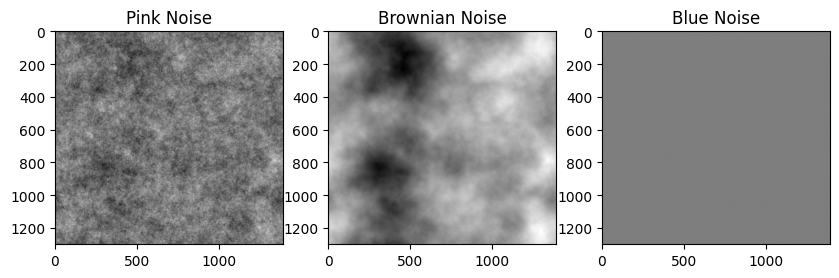
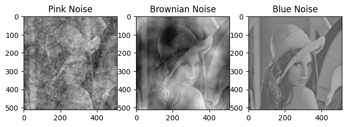

# Hyperspectral Image Restoration: Investigating the Impact of Noise and Occlusion

This repository includes code implementation for our project in the Computational Imaging course at IMT Atlantique, spring 2024.

This project is inspired by the paper of [Théo Bodrito et al](https://proceedings.neurips.cc/paper/2021/file/2b515e2bdd63b7f034269ad747c93a42-Paper.pdf). Their original implementation can be found [here](https://github.com/inria-thoth/T3SC).

Members:
- DUONG Hoang
- LUC Tan Tho
- Nguyen Le-Kim

Parts of this repository are forked directly from the original one. The brief description of our work is described in the table below:

<table>
<tr><td>

| File name | Description |
|-----------|-------------|
|run_compi.ipynb||
|COMPI_final.pdf|presentation slides of the topic|

</td></tr> </table>

## 1. Introduction
Trainable Spectral-Spatial Sparse Coding Model (T3SC Model) is a robust method using a hybrid approach (i.e. Deep Learning and Sparse Coding) to address the denoising problem of hyperspectral images. With a 2-layer sparse coding architecture, it offers high flexibility in terms of different bands of sensor and impressive capability in image restoration. Moreover, a 3-layer CNN function as a noise estimator provides excellent adaptivity to various types of noise.

In the scope of this project, we are interested in studying the robustness in case of complex noise. Furthermore, we also test the capability of restoration when some information is completely missing (occlusion).


## 2. Investigation on the impact of noise and occlusion
### 2.1. Noise
We implement some colors of noise to evaluate the model in dealing with complex noise. Some bands are affected by these noises (0.33 as default) and the rest have Gaussian white noise. 

There are 3 types supported currently: Pink, Brownian, and Blue. Noises and their impacts on Lena's image are shown below.





### 2.2. Occlusion
An area in the 2D image is zeroed. Similar to the previous part, we choose some bands to mask and add Gaussian white noise to every band of the image.


## 3. Experiments and Results
### 3.1. Experiments
Firstly, we run several tests for three new noises and occlusion using the pretrained models provided by authors. Then, we train our own models and run inference once again to evaluate the improvement.

**For noise**:
- The three noises with pretrained models.
- Pink noise with its own trained model (same configured parameters).
- Pink noise with its own trained models (different configured parameters).
- Other noise with trained model for pink noise (same configured parameters).

**NOTE:** Pink, Brownian and blue noise are characterized by variance $\sigma$, number of affected bands and noise scale.

**NOTE 2:** Currently, we only show the result for pink noise.

**For occlusion**:
- Tests with pretrained models.
- Test with its own trained model (same configured parameters).
- Test with its own trained model (different configured parameters).

**NOTE:** Occlusion is characterized by number of affected bands and size of masked area.

### 3.2. Results

### 3.3. Conclusion

## 4. How to run
### 4.1. Requirements
The model is developed with Python 3.8.8. You can run the command below, or follow the instruction in **run_compi** notebook.
```
pip install -r requirements.txt
```

### 4.2. Training and Testing
Please visit the original repository for more details. Currently, there are three available colors of noise: Pink, Brownian and Blue.

### Some examples
**Train**

ICVL dataset with pink noise
```
$ python main.py data=icvl noise=pink
```

Washington DC Mall dataset with occlusion
```
$ python main.py data=dcmall noise=occlusion
```

**Test**

```
$ python main.py mode=test data=icvl noise=pink noise params.sigma=25 model.ckpt=path/to/icvl_pink_25.ckpt
```

Some pretrained models can be found here.
 Feel free to modify the noise parameters to see the differences. You can access this folder for more information.