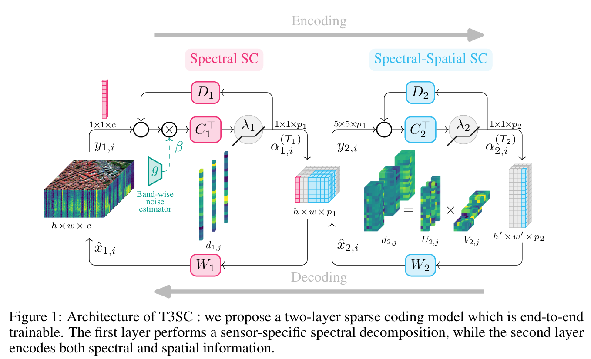
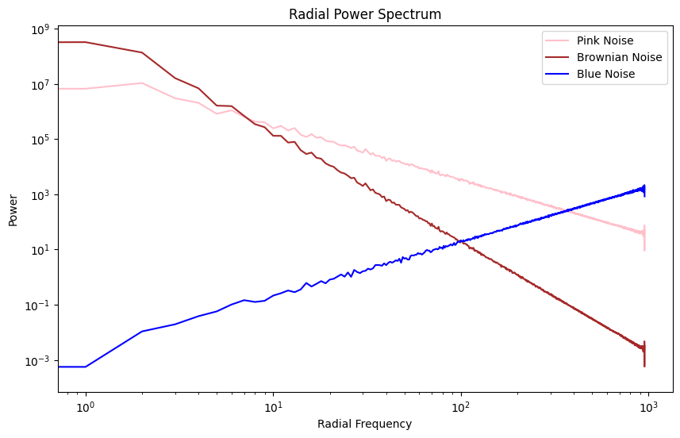
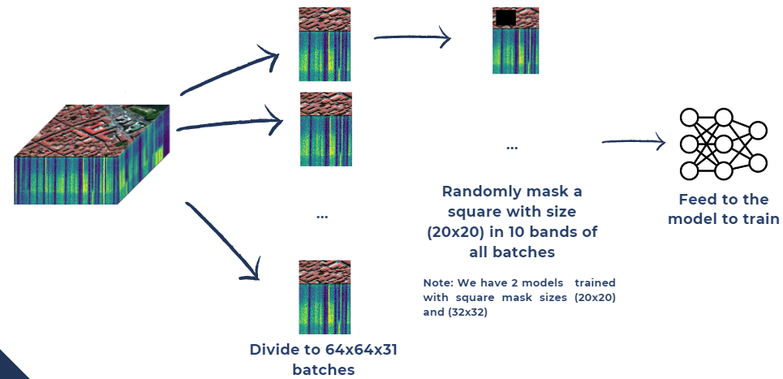
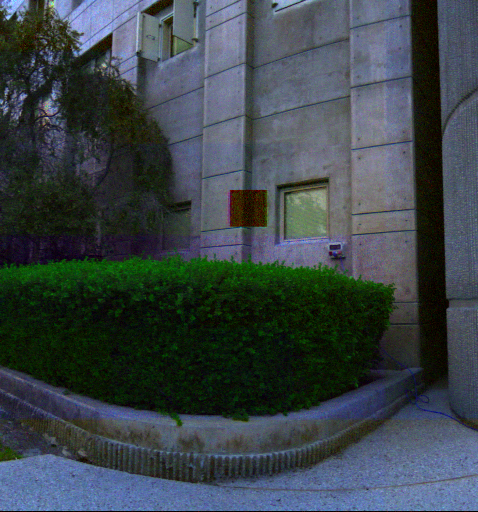
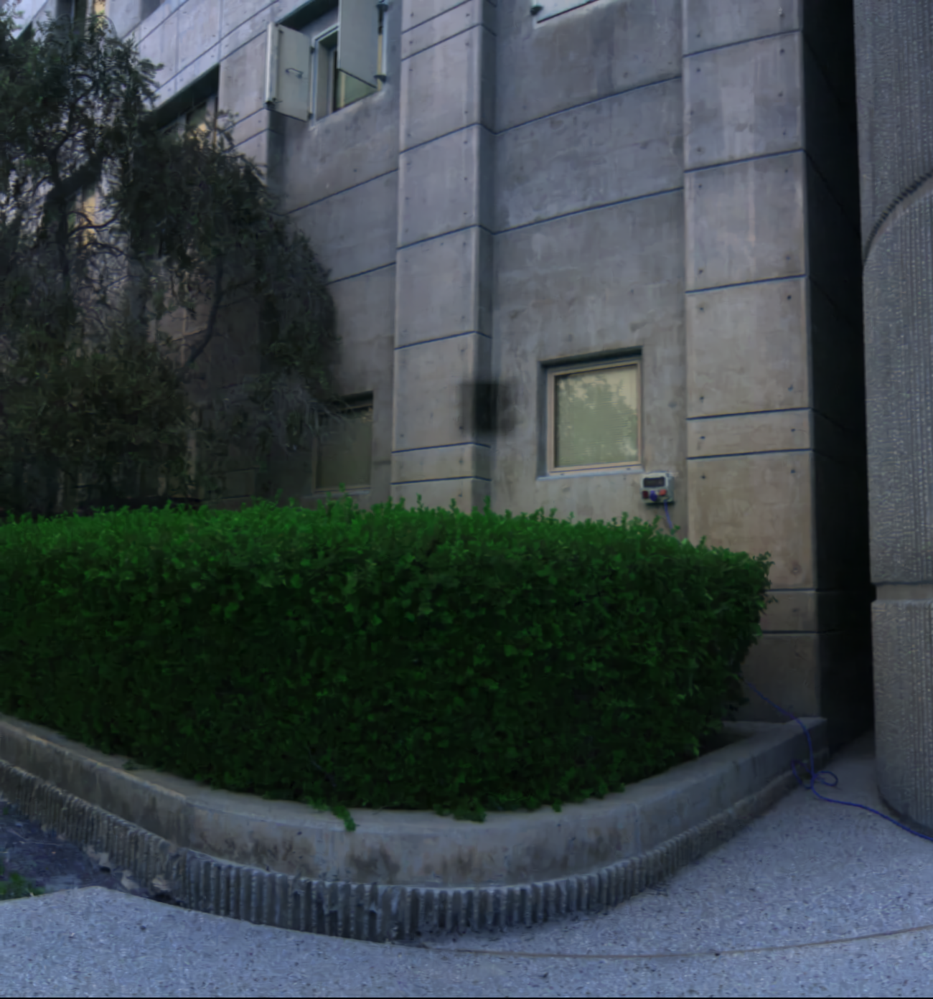
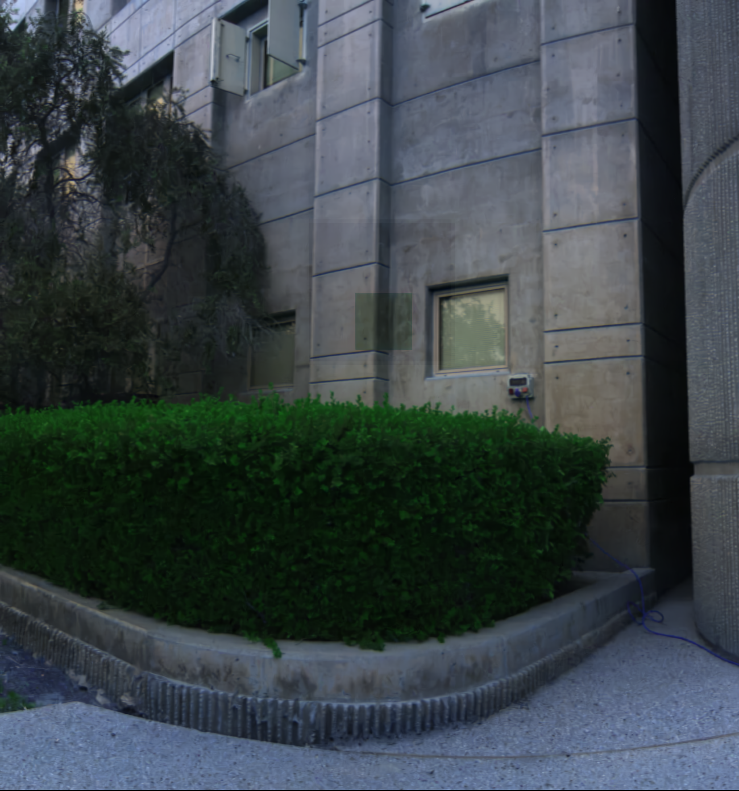
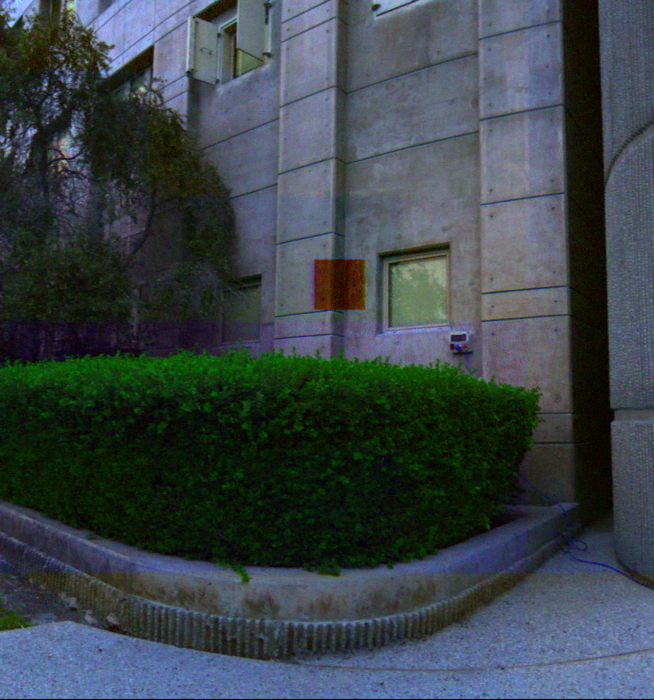
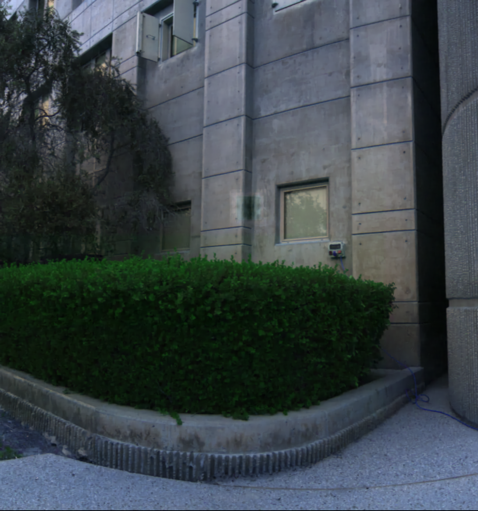

# Hyperspectral Image Restoration: Investigating the Impact of Noise and Occlusion

This repository includes code implementation for our project in the Computational Imaging course at IMT Atlantique, spring 2024.

This project is inspired by the paper of [Théo Bodrito et al](https://proceedings.neurips.cc/paper/2021/file/2b515e2bdd63b7f034269ad747c93a42-Paper.pdf). Their original implementation can be found [here](https://github.com/inria-thoth/T3SC).

Members:
- DUONG Hoang
- LUC Tan Tho
- Nguyen Le-Kim

## 1. Introduction
Trainable Spectral-Spatial Sparse Coding Model (T3SC Model) is a robust method using a hybrid approach (i.e. Deep Learning and Sparse Coding) to address the denoising problem of hyperspectral images. With a 2-layer sparse coding architecture, it offers high flexibility in terms of different bands of sensor and impressive capability in image restoration. Moreover, a 3-layer CNN function as a noise estimator provides excellent adaptivity to various types of noise.

In the scope of this project, we are interested in studying the robustness in case of complex noise. Furthermore, we also test the capability of restoration when some information is completely missing (occlusion).



## 2. Investigation on the impact of noise and occlusion
### 2.1. Noise
We implement some colors of noise to evaluate the model in dealing with complex noise. Some bands are affected by these noises (0.33 as default) and the rest have Gaussian white noise. 

There are 3 types supported currently: Pink, Brownian, and Blue. Noises and their impacts on Lena's image are shown below.





### 2.2. Occlusion
An area in the 2D image is zeroed. Similar to the previous part, we choose some bands to mask and add Gaussian white noise to every band of the image.

As described in the article, during training phase, each image will be divided into patches of size 64x64x31 pixels(ICVL dataset). In each patch, 10 arbitrary channels contain this masked area whose position is random and cross-spectrally independent. We train 2 models with mask size as follows:
- 20x20 pixels on a patch of 64x64 pixels
- 32x32 pixels on patch of 64x64 pixels



An example


## 3. Experiments and Results
### 3.1. Experiments
Firstly, we run tests for pink noise and occlusion using the pretrained models provided by authors. Then, we train our own models and run inference once again to evaluate the improvement. It is worthy to remark that we do not use Noise Adaptive Sparse Coding mechanism in these experiments, since it is strongly biased to the type of sensor, according to the authors.

In all tests, we use $\sigma=25$ for noise.

**For noise**:
- Inference with pretrained model.
- Inference with our trained model.

**NOTE:** We can modify the ratio between color noise and white noise  noise scale.

**NOTE 2:** Currently, we only show the result for pink noise.

**For occlusion**:
- Tests with pretrained models.
- Test with its own trained model (same configured parameters).
- Test with its own trained model (different configured parameters).

**NOTE:** Occlusion is configured by number of affected bands and size of masked area.

### 3.2. Results
**Noise**  
Firstly, we test the pink-noisy image (as described previously) at different percentages of affected bands with Gaussian pretrained model. Later, we train a model of all bands being pink-noisy then evaluate the performance at 33% and 100% of bands being affected.

*100% bands affected*
Original |Noisy| Gaussian pretrained | Our weights
:---:|:---:|:---:|:---:
||| 

*33% bands affected*
Original |Noisy|Gaussian pretrained | Our weights
:---:|:---:|:---:|:---:
||| 

The performance metrics are as follows:
Percentage| Weights | MPSNR in | MPSNR out | MSSIM in | MSSIM out 
:---:|:---:|:---:|:---:|:---:|:---:
100% |Gaussian pretrained|33.717|38.457|0.889|0.967
100% |Ours|33.717|39.182|0.889|0.980
33% |Gaussian pretrained|21.698|38.252|0.395|0.972
33% |Ours|21.698|31.712|0.395|0.665


**Occlusion**  
We train 2 models, then perform tests with some pretraied models and our weights on the ICVL dataset. We set the number of occluded bands to 10 and 5 respectively.

*Results of 10 bands*

Original |Gaussian pretrained  σ=25 | Stripes pretrained
:---:|:---:|:---:
||

Input |Our weights (20/64) | Our weights (32/64)
:---:|:---:|:---:
||

*Results of 5 bands*

Original |Gaussian pretrained σ=25 | Stripes pretrained
:---:|:---:|:---:
||

Input |Our weights (20/64) | Our weights (32/64)
:---:|:---:|:---:
||

The performance metrics of 10 affected bands:  
**MPSNR in** = 20.818, **MSSIM in** = 0.159, **MSE in** = 0.0083

Test | MPSNR out | MSSIM out | MSE out
:---:|:---:|:---:|:---:
Gaussian pretrained|39.234|0.971|0.0002
Stripes pretrained|29.219|0.693| - 
Our weights (20/64) (10 bands)|40.970|0.970|0.000103
Our weights (32/64) (10 bands)|40.982|0.968|0.000096

The performance metrics of 5 affected bands:  
**MPSNR in** = 20.863, **MSSIM in** = 0.159

Test | MPSNR out | MSSIM out 
:---:|:---:|:---:
Gaussian pretrained|41.098|0.972
Stripes pretrained|29.639|0.693
Our weights (20/64) (10 bands)|41.887|0.970
Our weights (32/64) (10 bands)|40.712|0.968

### 3.3. Conclusion
- The model proves the robustness not only for Gaussian noise but also its variants for certain percentages of affected bands.
- In case occlusion, the model not only maintain good capability of noise denoising but also well reconstruct the missing area. The performance can be slightly improved if we use a model trained with higher occluded band ratio to recover an image with lower ratio.

## 4. How to run
### 4.1. Requirements
The model is developed with Python 3.8.8. You can run the command below, or follow the instruction in **run_compi** notebook.
```
pip install -r requirements.txt
```

### 4.2. Training and Testing
Please visit the original repository for more details. Currently, there are three available colors of noise: Pink, Brownian and Blue.

### Some examples
**Train**

ICVL dataset with pink noise
```
$ python main.py data=icvl noise=pink
```

Washington DC Mall dataset with occlusion
```
$ python main.py data=dcmall noise=occlusion
```

**Test**

```
$ python main.py mode=test data=icvl noise=occlusion noise params.sigma=25 model.ckpt=path/to/
icvl_occlusion_20_20_mask_10_bands.ckpt
```

Some pretrained models can be found [here](https://drive.google.com/drive/folders/1Ak6JDUvH6bFK0h5FnE3cmvagIolMzyjB). Feel free to modify the noise parameters to see the differences.